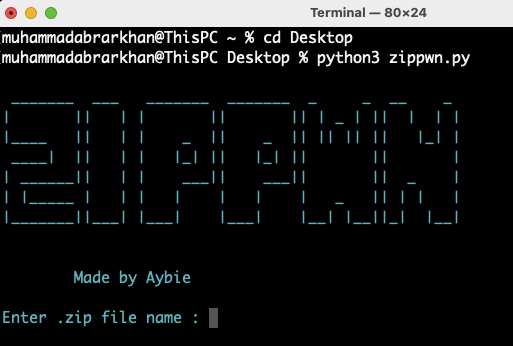
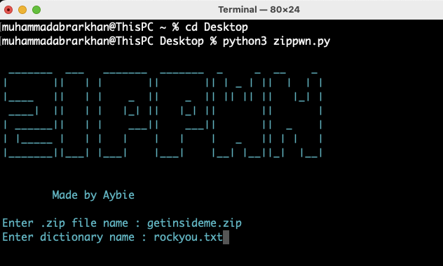
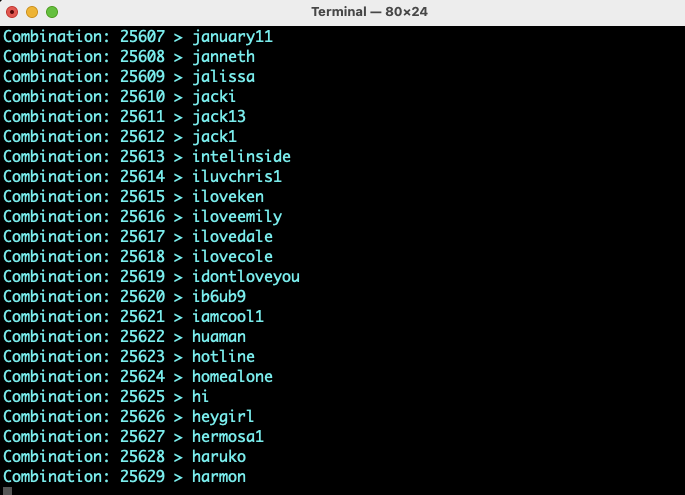
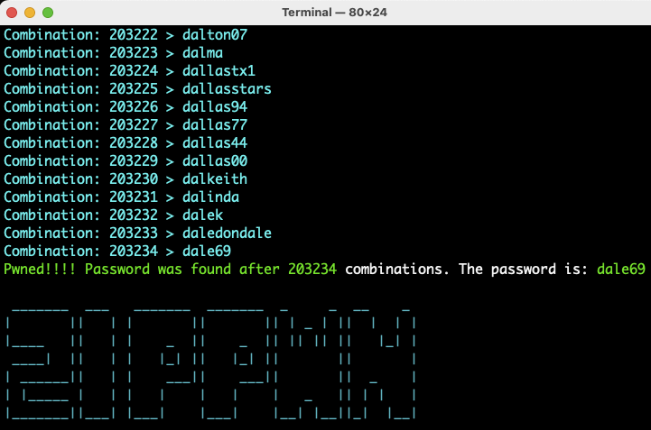

# ZIPPWN

<br>
by CyberAybie


## Description

A command line based tool that asks for a dictionary file and performs a dictionary attack to crack the zip password.

## Getting Started

### What you need?

* A zip file that is password protected.
* A dictionary file like this - https://github.com/brannondorsey/naive-hashcat/releases/download/data/rockyou.txt
* Python Installed in your system


### Installing

* Just download the zippwn.py file from the repository

### Executing program

#### Step 1:

* Have the python file, dictionary file and zip file in a directory
* open a terminal in that directory

```
python3 zippwn.py
```


#### Step 2:
 * Type in the zip file name and dictionary file name
 
 
 
 #### Step 3:
 * Dictionary Attack will begin
 
 

 #### Step 4:
 * Results
 
 
 
## Author
 
Abrar (CyberAybie is my tag) [See my Linkedin](https://www.linkedin.com/in/cyberaybie/)

## Version History

* 0.1
    * Initial Release

## License

This project is free to use
